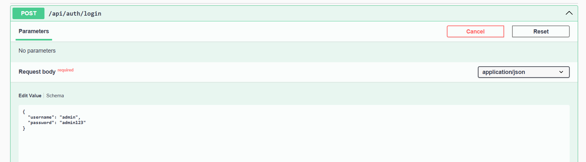
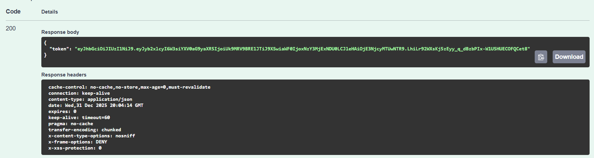
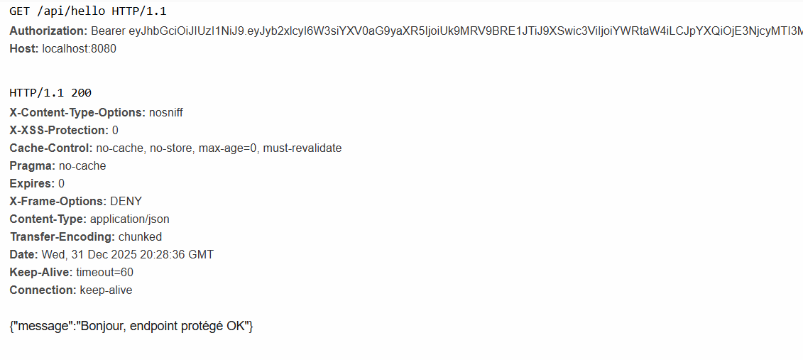
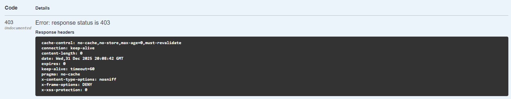

# TP-2: Authentication with JWT

A Spring Boot application demonstrating JWT (JSON Web Token) based authentication for securing REST APIs.

## 📋 Overview

This project implements a secure authentication system using JWT tokens with Spring Security. It provides a practical example of how to:

- Authenticate users and generate JWT tokens
- Protect REST API endpoints using JWT
- Configure Spring Security with custom JWT filter

## 🛠️ Technologies Used

| Technology | Version |
|------------|---------|
| Java | 21 |
| Spring Boot | 3.5.9 |
| Spring Security | Latest |
| JJWT (Java JWT) | 0.11.5 |
| Lombok | Latest |
| SpringDoc OpenAPI | 2.8.14 |
| Maven | 3.x |

## 📁 Project Structure

```
src/main/java/site/aloui/authenticationwithjwt/
├── Tp2AuthenticationWithJwtApplication.java   # Main application entry point
├── config/
│   └── SecurityConfig.java                    # Spring Security configuration
├── controller/
│   └── AuthController.java                    # REST controller for auth endpoints
├── dtos/
│   ├── AuthRequest.java                       # Login request DTO
│   └── AuthResponse.java                      # Login response DTO (contains token)
├── filter/
│   └── JwtAuthFilter.java                     # JWT authentication filter
├── model/                                     # Entity models (if needed)
└── service/
    ├── JwtService.java                        # JWT token generation & validation
    └── MyUserDetailsService.java              # User details service (in-memory users)
```

## ⚙️ Configuration

### Application Properties

```properties
spring.application.name=tp-2-authentication-with-jwt
server.port=8080

app.jwt.secret=ChangeThisSecretToAStrongOne_32chars_min
app.jwt.expiration-ms=3600000
```

| Property | Description |
|----------|-------------|
| `server.port` | Application port (default: 8080) |
| `app.jwt.secret` | Secret key for signing JWT tokens (min 32 characters) |
| `app.jwt.expiration-ms` | Token expiration time in milliseconds (default: 1 hour) |

## 👥 Default Users

The application comes with two pre-configured in-memory users:

| Username | Password | Role |
|----------|----------|------|
| `user` | `password` | USER |
| `admin` | `admin123` | ADMIN |

## 🚀 Getting Started

### Prerequisites

- Java 21 or higher
- Maven 3.x

### Running the Application

1. **Clone the repository**
   ```bash
   git clone <repository-url>
   cd tp-2-authentication-with-jwt
   ```

2. **Build the project**
   ```bash
   ./mvnw clean install
   ```

3. **Run the application**
   ```bash
   ./mvnw spring-boot:run
   ```

4. **Access the application**
   - API Base URL: `http://localhost:8080`
   - Swagger UI: `http://localhost:8080/swagger-ui.html`

## 📡 API Endpoints

### Authentication Endpoints

| Method | Endpoint | Description | Authentication |
|--------|----------|-------------|----------------|
| POST | `/api/auth/login` | Authenticate user and get JWT token | No |

### Protected Endpoints

| Method | Endpoint | Description | Authentication |
|--------|----------|-------------|----------------|
| GET | `/api/hello` | Protected endpoint example | Yes (JWT) |

## 📝 API Usage Examples

### 1. Login - Get JWT Token

**Request:**
```http
POST /api/auth/login
Content-Type: application/json

{
    "username": "user",
    "password": "password"
}
```

**Response:**
```json
{
    "token": "eyJhbGciOiJIUzI1NiJ9.eyJyb2xlcyI6W3siYXV0aG9yaXR5IjoiUk9MRV9VU0VSIn1dLCJzdWIiOiJ1c2VyIiwiaWF0IjoxNzM1NjQxMjAwLCJleHAiOjE3MzU2NDQ4MDB9.xxxxx"
}
```

### 2. Access Protected Endpoint

**Request (with valid token):**
```http
GET /api/hello
Authorization: Bearer <your-jwt-token>
```

**Response (Success - 200 OK):**
```json
{
    "message": "Bonjour, endpoint protégé OK"
}
```

**Response (Unauthorized - 403 Forbidden):**
```
Access Denied - Invalid or missing JWT token
```

## 📸 Screenshots

### Authentication Flow

#### 1. Login Request
Sending credentials to the login endpoint:



#### 2. Login Response
Receiving the JWT token after successful authentication:



### Accessing Protected Endpoints

#### 3. Success - With Valid Token
Accessing the protected `/api/hello` endpoint with a valid JWT token:



#### 4. Error - Without Token (403 Forbidden)
Attempting to access the protected endpoint without authentication:



## 🔐 Security Configuration

### Endpoint Security Rules

- `/api/auth/**` - Publicly accessible (no authentication required)
- `/swagger-ui.html`, `/swagger-ui/**`, `/v3/api-docs/**` - Publicly accessible for API documentation
- All other endpoints - Require valid JWT authentication

### JWT Token Structure

The JWT token contains:
- **Subject (sub)**: Username
- **Roles**: User authorities/roles
- **Issued At (iat)**: Token creation timestamp
- **Expiration (exp)**: Token expiration timestamp

## 🏗️ Architecture

### Authentication Flow

```
┌─────────┐      POST /api/auth/login       ┌──────────────┐
│  Client │ ──────────────────────────────► │ AuthController│
└─────────┘   {username, password}          └──────────────┘
                                                   │
                                                   ▼
                                           ┌──────────────┐
                                           │ AuthManager  │
                                           └──────────────┘
                                                   │
                                                   ▼
                                           ┌──────────────┐
                                           │UserDetailsService│
                                           └──────────────┘
                                                   │
                                                   ▼
                                           ┌──────────────┐
                                           │  JwtService  │
                                           └──────────────┘
                                                   │
                                                   ▼
┌─────────┐        JWT Token               ┌──────────────┐
│  Client │ ◄────────────────────────────  │AuthController│
└─────────┘                                └──────────────┘
```

### Protected Resource Access Flow

```
┌─────────┐  GET /api/hello + Bearer Token  ┌──────────────┐
│  Client │ ───────────────────────────────►│ JwtAuthFilter│
└─────────┘                                 └──────────────┘
                                                   │
                                           Validate Token
                                                   │
                                                   ▼
                                           ┌──────────────┐
                                           │  JwtService  │
                                           └──────────────┘
                                                   │
                                           Set SecurityContext
                                                   │
                                                   ▼
                                           ┌──────────────┐
                                           │AuthController│
                                           └──────────────┘
                                                   │
                                                   ▼
┌─────────┐        Response                ┌──────────────┐
│  Client │ ◄────────────────────────────  │AuthController│
└─────────┘                                └──────────────┘
```

## 📚 Key Components

### JwtService
Handles JWT token operations:
- `generateToken()` - Creates a new JWT token with claims
- `extractUsername()` - Extracts username from token
- `isTokenValid()` - Validates token authenticity and expiration

### JwtAuthFilter
A custom `OncePerRequestFilter` that:
- Intercepts all incoming requests
- Extracts JWT from `Authorization` header
- Validates the token
- Sets authentication in `SecurityContext`

### SecurityConfig
Configures Spring Security:
- Disables CSRF (suitable for stateless JWT auth)
- Defines public and protected endpoints
- Registers JWT filter before `UsernamePasswordAuthenticationFilter`

## 🧪 Testing with cURL

### Login
```bash
curl -X POST http://localhost:8080/api/auth/login \
  -H "Content-Type: application/json" \
  -d '{"username":"user","password":"password"}'
```

### Access Protected Endpoint
```bash
curl -X GET http://localhost:8080/api/hello \
  -H "Authorization: Bearer <your-token>"
```

## 📄 License

This project is for educational purposes as part of Distributed Systems Security practical activities.

---

**Author:** Bilal ALOUI  
**Course:** Distributed Systems Security

